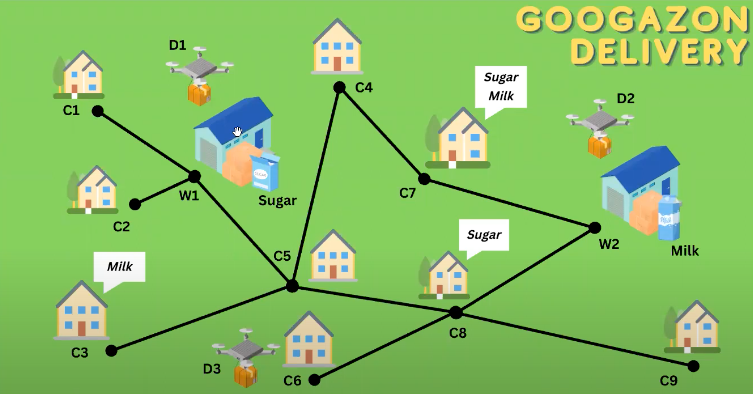

# Test Planner
In this repository are stored some easy PDDL execises solved using the **Unified Planning Framework**. This simple scenarios are useful to understand basic concepts of PDDL and the unified_planning library.

## Requirements
To use UPF, you must install the following libraries:

```
pip install unified-planning
pip install unified-planning['fast-downward']
```

The second library will download the actual planner, the tool that will find the solution given the problem and the domain of definition. 

## Problem 1 - Definition
There is a robot that operates in an environment containing a table and a shelf, where an apple is placed on the shelf. The objective is to have the robot transport the apple onto the table.

## Problem 2 - Definition
Three drones are tasked with delivering requested goods from shops to houses. Each drone is only capable of carrying one item at a time and must travel exclusively between adjacent locations.

<p align="center">

</p>
